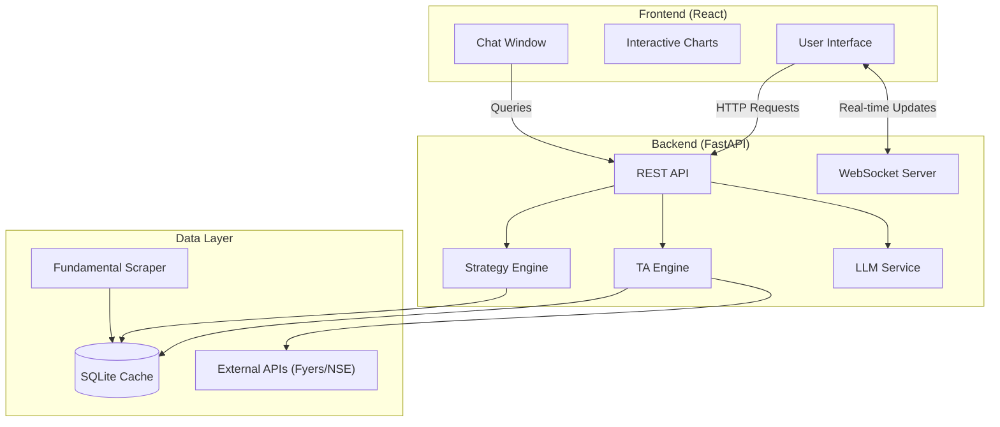
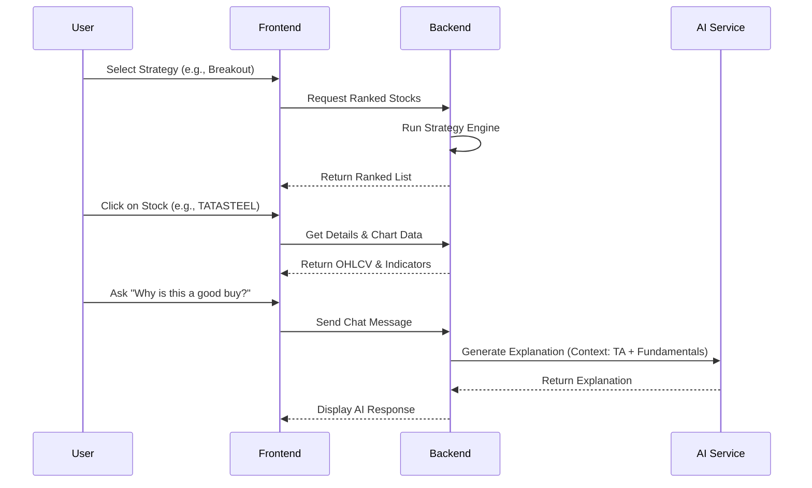

# Trading Chatbot 

A powerful web application that combines real-time stock analysis, technical strategy ranking, and an AI-powered chatbot to help traders make informed decisions.


## Features

- **Automated Strategy Ranking**: Scans the market for Breakout, Swing, and Day trading opportunities based on daily OHLCV data.
- **AI-Powered Analysis**: Integrated Chatbot (LLM) to explain technical signals and answer queries like "Why is RELIANCE in the top 5?".
- **Interactive Charts**: Detailed daily candle charts with annotated patterns, entry, stop, and target levels.
- **Real-time Updates**: WebSocket integration for live ranking updates and price changes.
- **Fundamental Insights**: Integrates fundamental data to provide a holistic view of stocks.

## Architecture

The system is built with a clean separation of concerns, featuring a FastAPI backend for data processing and a React frontend for the user interface.



## User Flow



## Tech Stack

- **Backend**: FastAPI (Python), Pandas, Pandas-TA, NumPy
- **Frontend**: React.js, TailwindCSS (optional), Plotly/Recharts
- **Database**: SQLite (for caching and metadata)
- **AI/LLM**: OpenAI API (or local LLM) for natural language explanations
- **Data Sources**: `nsepy` (Historical), Fyers (Real-time/Optional), Screener.in (Fundamentals)

## Setup Instructions

Follow these steps to get the project running on your local machine.

### Prerequisites

- Python 3.9 or higher
- Node.js and npm
- Git

### 1. Clone the Repository

```bash
git clone https://github.com/Anshul-ydv/Trading_Chatbot.git
cd Trading_Chatbot
```

### 2. Backend Setup

```bash
# Create a virtual environment
python -m venv .venv

# Activate the virtual environment
# On macOS/Linux:
source .venv/bin/activate
# On Windows:
# .venv\Scripts\activate

# Install dependencies
pip install -r requirements.txt
```

### 3. Frontend Setup

```bash
cd frontend
# Install Node dependencies
npm install
```

### 4. Environment Configuration

Create a `.env` file in the root directory and add your API keys:

```env
OPENAI_API_KEY=your_openai_api_key_here # Or u can use a local LLM like ollama (we used the local one so it will easier to set up)
FYERS_APP_ID=your_fyers_app_id_here  # Optional
FYERS_ACCESS_TOKEN=your_fyers_token_here # Optional
```

## Running the Application

### Start the Backend

From the root directory:

```bash
# Make sure your virtual environment is activated
uvicorn src.main:app --reload
or TCHATBOT/.venv/bin/python trading-chatbot/run.py
```
The API will be available at `http://localhost:8000`.

### Start the Frontend

Open a new terminal, navigate to the `frontend` folder:

```bash
cd frontend
npm start
or cd trading-chatbot/frontend && npm run dev
```
The application will open in your browser at `http://localhost:3000`.

## Contributing

Contributions are welcome! Please feel free to submit a Pull Request.

## License

This project is licensed under the MIT License - see the [LICENSE](LICENSE) file for details.
